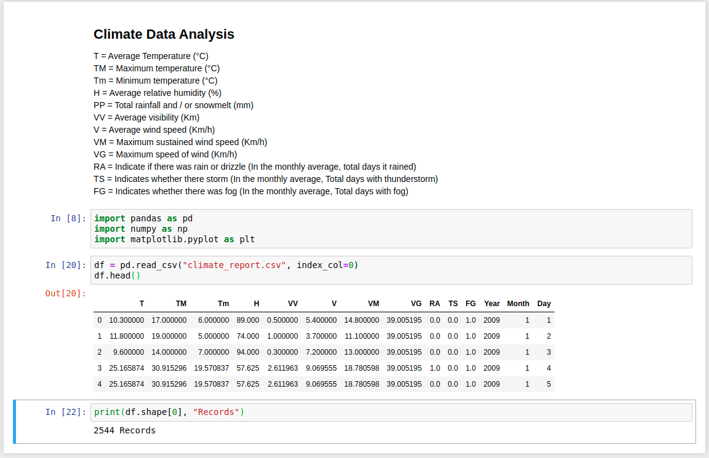

## Climate Report Scraper

Follow the [Readme](dataset_crawler/Readme.md) inside ``dataset_crawler`` directory to know the steps to scrape data. use ``climate_data_analysis.ipynb`` to begin your analysis with climate report of Delhi from year 2009 - 2015.

The data is being scraped from https://en.tutiempo.net/climate/01-2009/ws-421810.html, This repository is just an example on scraping tabular data from different websites.

The dataset which is being scraped in this particular example is:

This repo is just for demonnstration purpose only, for showing web data scraping however some values are missing while scraping so i filled them with average values. But tocollect all the data points without missing any values i have provided another solution using OCR method, you can read more about it [here](selenium_crawler)
